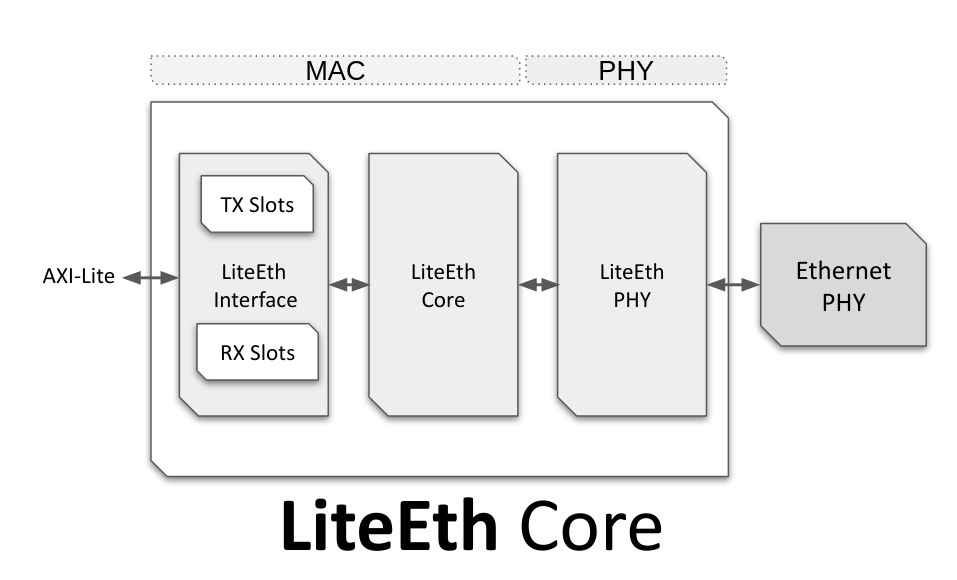

# AXIL ETHERNET Core Generation

## Introduction


The AXIL ETHERNET core is a configurable FPGA core that provides Ethernet connectivity/MAC to a CPU based system.

The Ethernet Media Access Control (MAC) is a hardware component that provides the interface between the FPGA and the Ethernet network. It is responsible for controlling access to the network and formatting data according to the Ethernet protocol, which is the standard protocol for transmitting data over a local area network (LAN).



The core has  has the following features:

**PHY:**
 - MII / RMII 100Mbps PHYs.
 - GMII / RGMII /1000BaseX 1Gbps PHYs.*

**Core:**
 - Configurable MAC (HW or SW interface)
 - ARP / ICMP / UDP (HW or SW)*

**Frontend:**
 - Etherbone (AXI-Lite/Wishbone over UDP: Slave or Master support)*

* Supported by LiteEth but not yet supported in the IP Catalog.


The EthPHY module provides the interface to the physical Ethernet medium, such as a twisted-pair or fiber optic cable. It includes sub-modules for clock generation (CRG), transmission (TX), and reception (RX), as well as a management data input/output (MDIO) module for accessing the PHY registers.

The EthMAC module is the main MAC module, which contains the logic for controlling access to the Ethernet network and formatting data according to the Ethernet protocol. It includes sub-modules for the MAC core, as well as separate datapath modules for transmission (tx_datapath) and reception (rx_datapath).

The Interface module provides an interface between the MAC module and the CPU. This interface is an AXI-Lite interface, which allows the host system to access the MAC registers and control its operation. The SRAM module is used for transmit and receive buffers of the MAC. It includes sub-modules for writing and reading data to and from the SRAM, as well as an interrupt controller (ev) for generating interrupts to the CPU.

More information and source code of the core can be found at: https://github.com/enjoy-digital/liteeth

## Architecture

AXIL ETHERNET has the following simplified architecture:

```
AXIL ETHERNET
└─── ethphy (LiteEthPHYMII)
│    └─── crg (LiteEthPHYMIICRG)
│    └─── tx (LiteEthPHYMIITX)
│    └─── rx (LiteEthPHYMIIRX)
│    └─── mdio (LiteEthPHYMDIO)
└─── ethmac (LiteEthMAC)
     └─── core (LiteEthMACCore)
     │    └─── tx_datapath (TXDatapath)
     │    └─── rx_datapath (RXDatapath)
     └─── interface (LiteEthMACWishboneInterface)
         └─── sram (LiteEthMACSRAM)
         │    └─── writer (LiteEthMACSRAMWriter))
         │    └─── reader (LiteEthMACSRAMReader)
         │    └─── ev (SharedIRQ)
         └─── sram_0* (SRAM)
         └─── sram_1* (SRAM)
         └─── sram_2* (SRAM)
         └─── sram_3* (SRAM)
         └─── decoder_0* (Decoder)
```

## Generator Script
This directory contains the generator script which generates the RTL to `rapidsilicon/ip/axil_ethernet/v1_0/<build-name>/src/` directory.

## Parameters
AXIL ETHERNET is a parametrizable core and the list/supported values of the available parameters can be
obtain with `./axil_ethernet_gen.py --help` command:

```
  --core_phy                          Ethernet PHY (mii or model).
  --core_ntxslots                     Number of TX Slots (1, 2 or 4).
  --core_nrxslots                     Number of RX Slots (1, 2 or 4).
  --core_bus_endianness {big,little}  Bus Endianness (big, little).
```

To generate RTL with above parameters, run the following command:
```
python3 axil_ethernet_gen.py --core_phy=mii --core_bus-endianness=big --build
```

## TCL File
This python script also generates a raptor.tcl file which will be placed in `rapidsilicon/ip/axil_ethernet/v1_0/<build-name>/synth/` directory.
