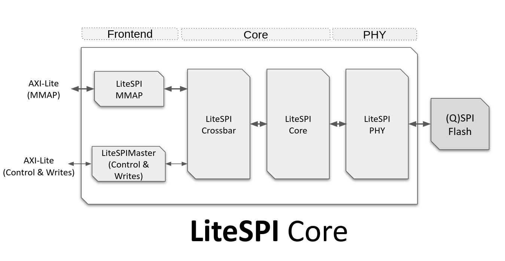

# AXIL QUADSPI Core Generation

## Introduction

The AXIL QUADSPI core is a configurable FPGA core that provides communication with external flash memory devices.

External flash memory is commonly used in FPGA designs to store the FPGA bitstream and CPU firmware. AXIL QUADSPI can be useful in any FPGA design that requires access to external flash memory for storing and accessing the FPGA bitstream and CPU firmware.



The core has  has the following features:

**PHY:**

 - Portable/Generic.
 - Single/Dual/Quad/Octal SPI Bus support.
 - Dynamic Clk frequency configuration and auto-calibration.

**Core:**
   - Dynamic Crossbar.
   - MMAP read accesses.
   - CSR-based read/write accesses.

AXIL QUADSPI supports three types of SPI flash access: single, dual, and quad. Single access uses a single data line to transfer data between the host system and the flash memory, while dual access uses two data lines and quad access uses four data lines. Using more data lines allows for higher data transfer rates, but may not be supported by all flash memory devices.

AXIL QUADSPI allows the user to select the type of SPI flash that is connected to the core, and configure the type of access that will be used. This allows the user to optimize the performance of the core for the specific flash memory device that is being used. For example, if the flash memory device supports quad access, the user can configure AXIL QUADSPI to use quad access for maximum data transfer performance.

More information and source code of the core can be found at: https://github.com/litex-hub/litespi

## Architecture

The core consists of several components, including LiteSPIPHY, LiteSPICore, LiteSPIMMAP and LiteSPIMaster.

AXIL QUADSPI has the following simplified architecture:
```
AXIL QUADSPI
└─── litespiphy_0* (LiteSPIPHY)
│    └─── spiflash_phy (LiteSPISDRPHYCore)
│    │    └─── resyncreg_0* (ResyncReg)
│    │    └─── clkgen (LiteSPIClkGen)
│    │    └─── waittimer_0* (WaitTimer)
│    │    └─── fsm (FSM)
└─── litespi_0* (LiteSPICore)
     └─── crossbar (LiteSPICrossbar)
     │    └─── rr (RoundRobin)
     │    └─── tx_mux (Multiplexer)
     │    └─── rx_demux (Demultiplexer)
     └─── mmap (LiteSPIMMAP)
     |    └─── waittimer_0* (WaitTimer)
     |    └─── fsm (FSM)
     └─── master (LiteSPIMaster)
```

-   **LiteSPIPHY**: This component generates the clock signals and provides a physical interface for communicating with the external flash memory device.
-   **LiteSPICore**: This component manages the data transfer between the external flash memory and the frontend modules. It includes a crossbar component, which routes data between the various frontend modules.
-   **LiteSPIMMAP**: This component provides an interface for mapping the external flash memory into the host system's memory space.
-   **LiteSPIMaster**: This component provides an interface for executing control commands on the external flash memory and do writes.

## Generator Script
This directory contains the generator script which generates the RTL to `rapidsilicon/ip/axil_quadspi/v1_0/<build-name>/src/` directory.

## Parameters
AXIL QUADSPI is a parametrizable core and the list/supported values of the available parameters can be
obtain with `./axil_quadspi_gen.py --help` command:

```
  --core-module                       SPI Flash Module.
  --core-mode           {x1,x4}       SPI Mode.
  --core-rate           {1:1,1:2}     SPI Flash Core rate.
  --core-divisor        range(1, 256) SPI Clk Divisor.
  --core-bus-endianness {big,little}  Bus Endianness (big, little).
```

To generate RTL with above parameters, run the following command:
```
python3 axil_quadspi_gen.py --core-module=S25FL128L --core-mode=x1 --core-rate=1:1 --core-divisor=1 --core-bus-endianness=big --build
```

## TCL File
This python script also generates a raptor.tcl file which will be placed in `rapidsilicon/ip/axil_quadspi/v1_0/<build-name>/synth/` directory.
